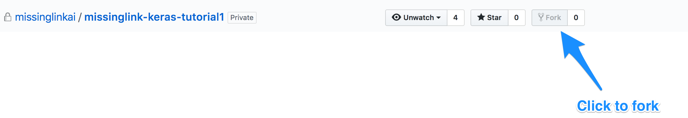
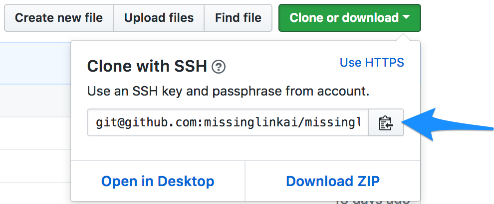
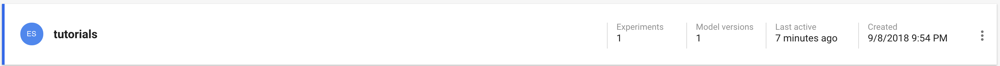
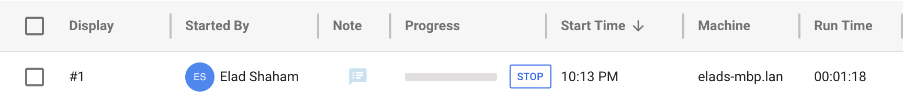
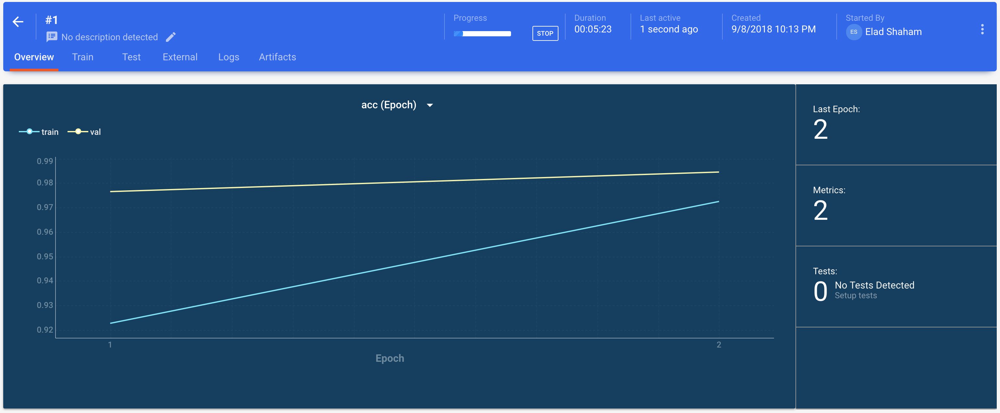

# Intro

In this tutorial we will take an existing implementation of a deep learning algorithm and integrate it into the MissingLink system. We will take a code sample training on the MNIST dataset using a convolutional neural network, add the MissingLink SDK and eventually run the experiment in a MissingLink controlled emulated server.

# Getting Started

## Prerequisites

To run this tutorial you will need a MissingLink account. If don't already have one, please [head to the MissingLink website and sign up](https://missinglink.ai/console/signup/userdetails).

---
**NOTE**  
This tutorial is assuming you’re using virtualenv to scope your working environment.
If you don't have it installed already, you can follow [this guide](https://packaging.python.org/guides/installing-using-pip-and-virtualenv/).

---

## First Thing’s First

Let’s head to the MissingLink Keras Tutorial 1 [Github repository](https://github.com/missinglinkai/missinglink-keras-tutorial1), and examine it. Notice it contains the program file, `mnist_cnn.py`, and a `requirements.txt` file. This code trains a simple convnet on the MNIST dataset (borrowed from [Keras examples](https://github.com/keras-team/keras/blob/master/examples/mnist_cnn.py)).  

In order for us to make changes, we will need to create a copy of the repo and fetch it to your local development environment.  
Please go ahead and create a fork of the [tutorial repository](https://github.com/missinglinkai/missinglink-keras-tutorial1), by clicking on the fork button.



<!--- TODO: take another screenshot when we make the repo public --->

After the forked repository was created, we will need to clone it locally in our workstation. Click the clone button in Github:


Now copy the url for cloning the repository:



Next, let’s open our terminal and git clone using the pasted url of your forked repository:  

```bash
$ git clone git@github.com:<YOUR_GITHUB_USERNAME>/missinglink-keras-tutorial1.git
```

Now that the code is on your machine, let's prepare our environment:

```bash
$ python3 -m virtualenv env
$ source env/bin/activate
$ pip install -r requirements.txt
```

## Let's Run It

You can try to run the example:

```bash
$ python mnist_cnn.py
```


As you can see, the code runs the experiment in 12 epochs.

# Integrating the MissingLink SDK

Now, let's see how by adding a few lines of code and a few commands, we're able to follow our experiment in MissingLinks web dashboard.

## Install and init the MissingLink CLI

MissingLink provides a CLI (command line interface) which allows you to control everything from the terminal.
Let's go ahead and install it:

```bash
$ pip install MissingLink
```

Next we want to authenticate with the MissingLink backend.

---
**NOTE**  
Once you run the following command, a browser window will launch and navigate to the MissingLink website.
If you're not logged in, you will be asked to login. When the process is completed, you will get a message to go back to the console.

---

```bash
$ ml auth init
```

## Creating a project

MissingLink allows you to manage several projects. Let's create a new project for this tutorial:

```bash
$ ml projects create --display-name tutorials
```

---
**NOTE**  
You can see a list of all your projects by running `ml projects list`, or obviously by going to the [MissingLink web console](https://missinglink.ai/console).

---

## Updating the requirements

Let's go ahead and open the code in your favorite IDE.
We need to add the MissingLink SDK as a requirement under `requirements.txt` file:

```diff
tensorflow
keras
+missinglink
```

Now let's install the new requirements:

```bash
$ pip install -r requirements.txt
```

## Adding a callback to Keras

Open the `mnist_cnn.py` script file and import the MissingLink SDK:
```diff
// ...
from keras.layers import Dense, Dropout, Flatten
from keras.layers import Conv2D, MaxPooling2D
from keras import backend as K
+import missinglink

batch_size = 128
num_classes = 10
epochs = 12
// ...
```

Now we need to initialize a callback object that we could have Keras call during the different stages of the experiment.

<!--- TODO: Make sure it works without user id and project id / token) --->

```diff
// ...
from keras.layers import Conv2D, MaxPooling2D
from keras import backend as K
import missinglink
+
+missinglink_callback = missinglink.KerasCallback()
 
batch_size = 128
num_classes = 10
epochs = 12
// ...
```

Finally let's have Keras use our callback object. We want to add calls during fitting and test stages.  
Let's scroll all the way to the bottom of the file and add the MissingLink callback to the `fit()` function call:

```diff
// ...
model.fit(x_train, y_train,
          batch_size=batch_size,
          epochs=epochs,
          verbose=1,
          validation_data=(x_test, y_test),
+         callbacks=[missinglink_callback])

score = model.evaluate(x_test, y_test, verbose=0)
print('Test loss:', score[0])
print('Test accuracy:', score[1])
// ...
```

Lastly, we want to let the MissingLink SDK know we're starting the testing stage:

```diff
// ...
model.fit(x_train, y_train,
          batch_size=batch_size,
          epochs=epochs,
          verbose=1,
          validation_data=(x_test, y_test),
          callbacks=[missinglink_callback])

-score = model.evaluate(x_test, y_test, verbose=0)
+with missinglink_callback.test(model):
+    score = model.evaluate(x_test, y_test, verbose=0)
+
print('Test loss:', score[0])
print('Test accuracy:', score[1])
// ...
```

## Run the Integrated Experiment
We're now all set up to run the experiment again, but this time to see it in the Missing Link dashboard.  

Let's go back to the terminal and run our script again:

```bash
$ python mnist_cnn.py
```

You should see the initialization and the beginning of training. Now, let's switch back to the MissingLink dashboard.

Open the [MissingLink console](https://missinglink.ai/console) and click on the projects toolbar button on the left. On this page you should see the list of experiments which belong to your project.



Choose the `tutorials` project, you will see your experiment appear.  



Now you can click anywhere on the experiment line to show more info about the experiment's progress.



---
**NOTE**  
Feel free to browse through the table and the different tabs of the experiment you're running, and see how the metrics update as the experiment progresses. This tutorial does not include an explanation about these screens. For a detailed walkthrough, click here.

---

## Commit the Code Changes

Let's commit our code to the repo. Go to your terminal and run the following commands:

```bash
$ git add .
$ git commit -m "integrate with missinglink"
$ git push
```

# Adding Resource Management

Now that we have everything working so nicely on our local workstation, we would like to take the integration to the next level. MissingLink can help you manage your servers so that you don't have to worry about it.

<!--- TODO: Link to a good RM explanation --->

The next step for us would be to run the experiment on a managed server. For the sake of simplicity, we will not connect real GPU servers in this tutorial, but rather emulate a real server on our local workstation. But it should definitely give you a sense of how it would work when running on real servers.

## The Missing Step

The most important step for setting up resource management in your project would be to give us access to your training machines. For that you will basically need to install missinglink on your existing machines, or give us limited access to your cloud hosting account so we can spin up machines for you. As mentioned above, we will not do this step in this tutorial.

## Let's emulate

Now for some magic; We'll need to run a command for launching the local server using the MissingLink CLI.
Let's run the following in our terminal:

```bash
$ ml run local --git-repo git@github.com:<YOUR_GITHUB_USERNAME>/missinglink-keras-tutorial1.git --command "python mnist_cnn.py"
```

This command would take the code you've committed to your forked repository, clone it to your local server, install the requirements and run `python mnist_cnn.py`.

---
**NOTE**  
The command for running the same thing on a real server is very similar.

---

## Observe the progress

If everything goes well, we can now observe the progress of our experiment, running on a managed server, right in the dashboard.  
Go to https://missinglink.ai/console and click on the Resource Groups toolbar button on the left. You should see a newly created resource group representing our local emulated server.

<!--- TODO: Add a screenshot of the resource group --->

---
**NOTE**  
This resource group is temporary and would disappear from the list once the job we're running is completed.

---

Click on the line showing the emulated server - you would be navigated to see the logs of the task running in our local server.

<!--- TODO: Add a gif showing the progress of the logs --->

Let's go see the actual progress of our experiment. Click on the projects toolbar button on the left and choose the `tutorials` project. You should see the new experiment's progress.
